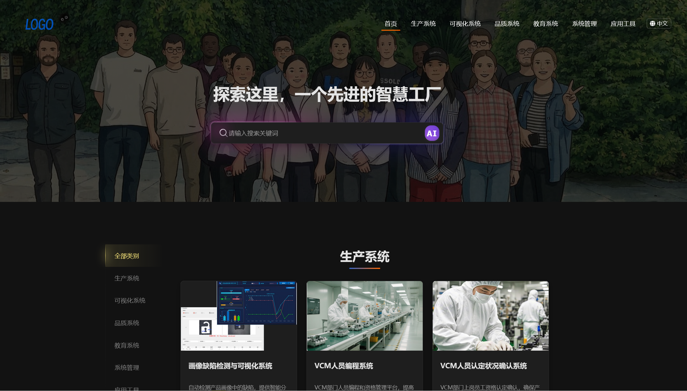
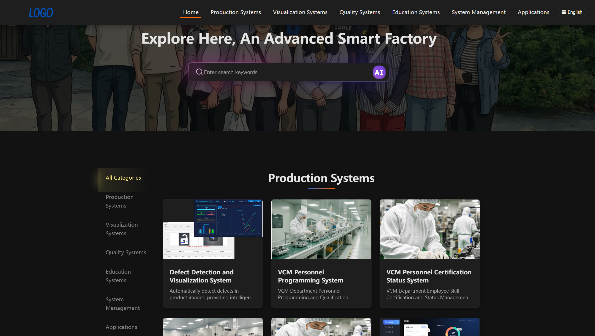
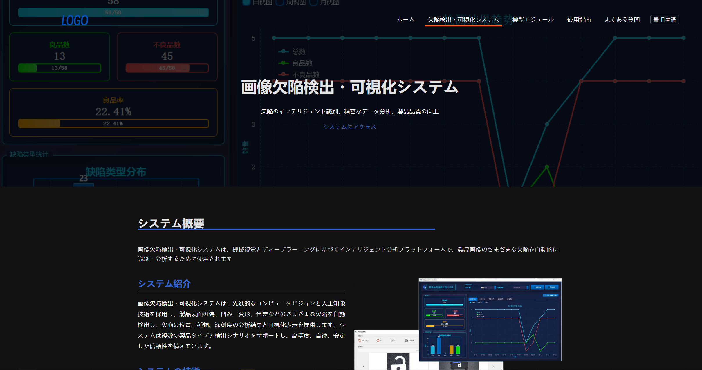
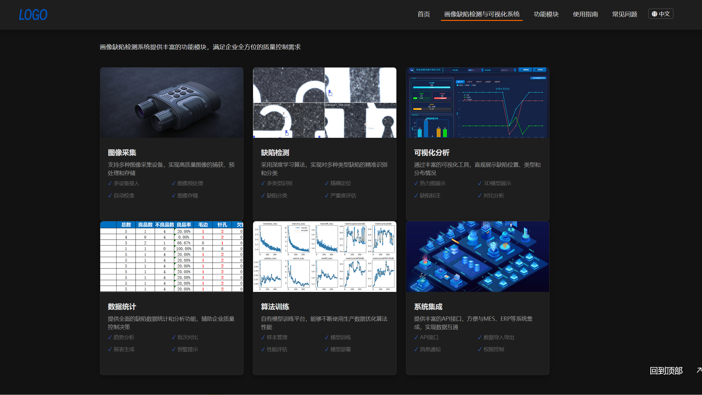
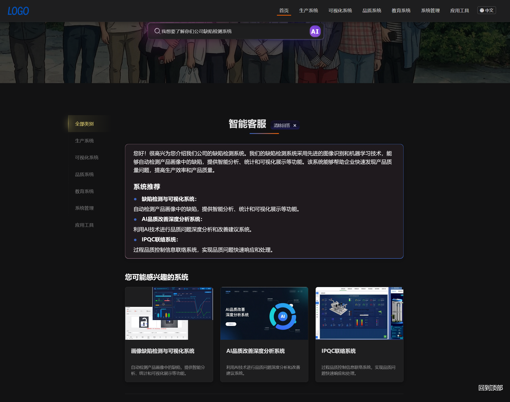

# 融合门户网站 — 实习项目展示

（因实习单位保密协议，本仓库仅展示项目效果与个人工作内容，**不提供任何源代码**）

## 一、项目概述

本项目是我在阿尔卑斯阿尔派（中国）有限公司无锡研发中心实习期间开发的**企业融合门户网站**。该项目主要用于展示公司内部所有已开发的信息化系统，提供统一的系统入口和导航服务。

网站集成了 **AI 智能客服** 功能，基于 AnythingLLM RAG 框架实现，能够回答用户关于各系统的相关问题，并智能推荐可能感兴趣的系统。

## 二、技术栈

- **前端框架**：HTML5 + CSS3 + JavaScript (ES6+)
- **UI 框架**：Bootstrap 5
- **脚本库**：jQuery 3.6
- **多语言支持**：自定义 i18n 方案（支持中文、英文、日文）
- **AI 智能客服**：AnythingLLM RAG 框架（需自行配置）
- **图表库**：Chart.js、ECharts
- **图标**：Font Awesome、IconFont、自定义图标

## 三、我的工作内容

本项目由我独立完成从需求分析到上线的全部开发工作，具体内容如下：

### 3.1 需求分析与规划

- 梳理公司所有已上线的信息化系统，确定展示系统数量为 33 个

- 根据业务类型将系统划分为 6 大类别：生产类、可视化类、品质类、教育类、系统类、应用类

- 确定网站功能和交互设计方案

### 3.2 前端页面开发

- 独立编写所有 HTML 页面，包括 1 个主页面和 33 个系统子页面

- 完成全部 CSS 样式开发，包括布局、配色、动画效果等

- 实现 JavaScript 交互逻辑，包括分类筛选、搜索功能、滚动效果等

- 使用 Bootstrap 5 框架构建响应式布局，确保在电脑、平板、手机等多种设备上正常显示

### 3.3 多语言支持实现

- 设计并实现基于 JSON 文件的 i18n 多语言方案

- 创建 3 套语言包文件（zh.json、en.json、ja.json），包含数千条翻译文本

- 实现语言切换功能，支持中文、英文、日文一键切换

- 解决多语言字符编码和特殊显示问题

### 3.4 AI 智能客服集成

- 调研并引入 AnythingLLM RAG 框架

- 设计与 AI 对话的提示词模板（Prompt），让 AI 能够扮演智能客服角色

- 实现工作区自动获取、对话线程创建、消息发送等功能

- 设计 AI 推荐系统的解析逻辑，自动从回复中提取相关系统并展示推荐卡片

### 3.5 搜索与筛选功能

- 实现基于关键词的本地系统搜索功能

- 开发分类筛选功能，支持按类别快速定位系统

- 添加搜索结果高亮显示和智能推荐

### 3.6 用户体验优化

- 实现平滑滚动和页面动画效果

- 开发“返回顶部”快捷按钮

- 添加加载状态指示器（Loading 动画）

- 优化页面性能，减少加载时间

### 3.7 测试与部署

- 在多种浏览器和设备上进行兼容性测试

- 修复测试过程中发现的 Bug 和样式问题

- 负责项目上线部署工作

## 四、项目效果展示

### 4.1 页面截图

网站首页：



全网站切换为英语：



项目详情页介绍：



项目详情页具体内容：



首页的智能客服问题解答与系统推荐：



### 4.2 功能演示


### 4.3 系统导航

- 按类别展示所有信息化系统
- 每个系统配有独立的介绍页面
- 包含系统概述、功能模块、使用指南等详细内容

### 4.4 智能搜索

- 支持关键词搜索系统
- 实时显示搜索结果

### 4.5 AI 智能客服

- 基于 AnythingLLM 的智能问答系统
- 能够回答用户关于各系统的问题
- 智能推荐相关系统（需配置 AnythingLLM 服务）

### 4.6 多语言支持

- 支持简体中文、英文、日文三种语言
- 语言切换功能，记忆用户偏好

### 4.7 用户体验优化

- 响应式设计，适配多种设备
- 分类筛选功能
- 返回顶部功能
- 平滑滚动动画

## 五、项目亮点与个人收获

1. **纯前端实现**：无需后端服务器，降低部署成本和维护复杂度
2. **多语言支持**：一键切换中、英、日三种语言，满足国际化需求
3. **AI 智能交互**：基于 RAG 技术的智能客服，提供精准的系统推荐
4. **良好的用户体验**：响应式设计、流畅的动画效果、人性化的交互设计
5. **可扩展性强**：模块化的代码结构，便于后续添加新系统

## 六、目录结构

```plain
49_SFHP/
└── 03_Sourcecode/
    ├── index.html                    # 主页面（融合门户首页）
    ├── 智能客服使用说明.txt           # 智能客服配置说明
    ├── README.md                     # 项目图片管理指南
    ├── category-systems-map.md       # 系统分类映射表
    ├── system-images-guide.md        # 系统图片指南
    ├── 多语言支持实现指南.md          # 多语言实现文档
    ├── 子页面翻译提示词.md             # 翻译工作提示
    ├── 语言选择器样式提示词.md         # 语言切换器样式说明
    ├── 系统.md                        # 系统清单
    │
    ├── assets/
    │   ├── css/                      # 样式文件
    │   │   ├── bootstrap.min.css
    │   │   ├── animate.min.css
    │   │   ├── style.css
    │   │   ├── responsive.css
    │   │   ├── backtotop.css
    │   │   └── iconfont.css
    │   │
    │   ├── js/                       # 脚本文件
    │   │   ├── jquery-3.6.0.min.js
    │   │   ├── bootstrap.min.js
    │   │   ├── i18n.js               # 多语言支持脚本
    │   │   ├── main.js               # 主逻辑脚本
    │   │   └── scroll.js             # 滚动效果脚本
    │   │
    │   ├── locales/                  # 语言包文件
    │   │   ├── zh.json               # 中文语言包
    │   │   ├── en.json               # 英文语言包
    │   │   └── ja.json               # 日文语言包
    │   │
    │   ├── html/                     # 各系统子页面
    │   │   ├── system1/
    │   │   │   ├── defect-detection.html
    │   │   │   ├── defect-visualization.html
    │   │   │   └── defect-app-local.html
    │   │   ├── system2/
    │   │   │   └── vcm-programming.html
    │   │   ├── ······
    │   │   │  
    │   │   ├── ······
    │   │   │   
    │   │   ├── ······
    │   │   │
    │   │   └── system33/
    │   │       └── dfmea-system.html
    │   │
    │   └── images/                   # 图片资源目录
    │       └── README.txt
```

## 七、版权说明

- 本项目知识产权与完整源码归原公司所有
- 本仓库仅为学习与展示使用，请勿商用

## 八、附录

### 8.1 多语言支持实现指南（基于外部JSON语言文件）

本指南解释如何为系统页面添加中文、英文和日文的多语言支持。语言包已从 `i18n.js` 分离至 `assets/locales` 下的独立 JSON 文件中。

#### 1. HTML文件修改

##### 1.1 添加语言切换器

在 `<body>`标签开始处添加以下代码：

```html
<!-- 语言切换器 -->
<div class="language-switcher">
    <button class="language-btn" onclick="i18n.setLanguage('zh')" data-i18n="common.chinese">中文</button>
    <button class="language-btn" onclick="i18n.setLanguage('ja')" data-i18n="common.japanese">日本語</button>
    <button class="language-btn" onclick="i18n.setLanguage('en')" data-i18n="common.english">English</button>
</div>
```

##### 1.2 添加语言切换器样式

###### 1. **引入Font Awesome图标库**

在 `<head>`标签内加入（如已引入可跳过）：

```html
<link rel="stylesheet" href="https://cdnjs.cloudflare.com/ajax/libs/font-awesome/5.15.4/css/all.min.css">
```

###### 2. **样式调整**

在 `<style>`标签内添加或合并如下CSS（建议放在自定义样式区）：

```css
.language-dropdown {
    margin-left: 10px;
    position: relative;
}
.language-dropdown .dropdown {
    display: inline-block;
}
.language-dropdown .btn {
    color: #fff;
    font-size: 14px;
    padding: 3px 8px;
    border: 1px solid rgba(255,255,255,0.3);
    border-radius: 4px;
    background: transparent;
}
.language-dropdown .btn:hover {
    background: rgba(255,255,255,0.1);
}
.language-dropdown .dropdown-menu {
    min-width: 100px;
    background: rgba(0,0,0,0.8);
    border: 1px solid rgba(255,255,255,0.1);
    margin-top: 0;
    padding: 0;
    position: absolute;
    display: none;
    right: 0;
}
.language-dropdown .dropdown.show .dropdown-menu {
    display: block;
}
.language-dropdown .dropdown-item {
    color: #fff;
    font-size: 14px;
    padding: 5px 15px;
    display: block;
    text-decoration: none;
}
.language-dropdown .dropdown-item:hover {
    background: rgba(255,255,255,0.1);
}
.language-dropdown .dropdown-item.active {
    background: rgba(255,255,255,0.2);
}
/* 导航栏布局调整 */
.navbar-brand-container {
    display: flex;
    align-items: center;
}
```

###### 3. **导航栏结构调整**

将导航栏部分替换为如下结构（以Bootstrap为例，注意路径和类名根据实际情况调整）：

```html
<div class="container-lg d-flex align-items-center justify-content-between">
    <div class="navbar-brand-container">
        <a class="navbar-brand" href="...">
            
            
        </a>
    </div>
    <div class="d-flex align-items-center">
        <button class="navbar-toggler collapsed" type="button" data-toggle="collapse" data-target="#navbarDefault" aria-controls="navbarDefault" aria-expanded="false" aria-label="Toggle navigation">
            <span></span>
            <span></span>
            <span></span>
        </button>
        <div class="navbar-collapse collapse justify-content-end" id="navbarDefault">
            <ul class="navbar-nav">
                <!-- 你的导航项 -->
            </ul>
        </div>
        <!-- 语言选择下拉菜单 -->
        <div class="language-dropdown ml-3">
            <div class="dropdown">
                <button class="btn" type="button" id="languageDropdown" onclick="toggleLanguageDropdown(event)">
                    <i class="fas fa-globe"></i> <span id="current-language">中文</span>
                </button>
                <div class="dropdown-menu" id="languageDropdownMenu">
                    <a class="dropdown-item language-option" href="#" onclick="selectLanguage('zh', event)" data-i18n="common.chinese">中文</a>
                    <a class="dropdown-item language-option" href="#" onclick="selectLanguage('ja', event)" data-i18n="common.japanese">日本語</a>
                    <a class="dropdown-item language-option" href="#" onclick="selectLanguage('en', event)" data-i18n="common.english">English</a>
                </div>
            </div>
        </div>
    </div>
</div>
```

###### 4. **添加下拉菜单JS逻辑**

在 `</body>`前添加如下脚本（如已存在可合并）：

```html
<script>
    // 切换语言下拉菜单
    function toggleLanguageDropdown(event) {
        event.preventDefault();
        event.stopPropagation();
        const dropdown = document.querySelector('.language-dropdown .dropdown');
        dropdown.classList.toggle('show');
    }
    // 选择语言
    function selectLanguage(lang, event) {
        event.preventDefault();
        event.stopPropagation();
        i18n.setLanguage(lang);
        document.querySelector('.language-dropdown .dropdown').classList.remove('show');
    }
    // 点击页面其他地方关闭下拉菜单
    document.addEventListener('click', function(event) {
        const dropdown = document.querySelector('.language-dropdown .dropdown');
        if (dropdown && dropdown.classList.contains('show') && !dropdown.contains(event.target)) {
            dropdown.classList.remove('show');
        }
    });
    // 初始高亮当前语言
    document.addEventListener('DOMContentLoaded', function() {
        const currentLang = i18n.getCurrentLang();
        const options = document.querySelectorAll('.language-dropdown .language-option');
        options.forEach(option => {
            if (option.getAttribute('onclick').includes(currentLang)) {
                option.classList.add('active');
            }
        });
    });
</script>
```

###### 5. **删除原有的语言切换器**

删除页面上原有的 `.language-switcher` 相关HTML和CSS。


##### 1.3 添加i18n初始化脚本

在加载其他JS文件之前添加以下初始化脚本：

```html
<script>
window.addEventListener('load', function() {
    if (typeof i18n === 'undefined') {
        console.error('i18n 未加载!');
    } else {
        console.log('i18n 已加载，版本:', i18n.currentLang);
        const currentLang = localStorage.getItem('userLanguage') || 'zh';
        i18n.setLanguage(currentLang);
        document.querySelectorAll('.language-btn').forEach(btn => {
            btn.classList.remove('active');
            if (btn.getAttribute('onclick').includes(currentLang)) {
                btn.classList.add('active');
            }
        });
    }
});
</script>
```

##### 1.4 为需要翻译的文本添加data-i18n属性

为所有需要支持多语言的文本元素添加 `data-i18n`属性，属性值格式为：`systems.系统名称.文本标识符`

例如：

```html
<h1 data-i18n="systems.drying_history.title">系统标题</h1>
<p data-i18n="systems.drying_history.subtitle">系统副标题</p>
```

#### 2. 语言包JSON文件修改

##### 2.1 语言包文件位置

语言包已分离为三个独立JSON文件：

- 中文：`assets/locales/zh.json`
- 英文：`assets/locales/en.json`
- 日文：`assets/locales/ja.json`

##### 2.2 添加翻译内容

需要为所有三种语言文件添加相同结构的翻译内容。以下是添加新系统翻译的步骤：

1. 打开相应语言的JSON文件（如 `zh.json`）
2. 找到 `systems` 对象（如果不存在，需创建）
3. 在 `systems` 对象中添加新的系统翻译对象

示例（添加新系统翻译）：

```json
{
  "common": { ... },
  "menu": { ... },
  "systems": {
    "已有系统1": { ... },
    "已有系统2": { ... },
    "新系统名称": {
      "page_title": "页面标题",
      "title": "系统标题",
      "subtitle": "系统副标题",
      "description": "系统描述"
      // ... 其他翻译项
    }
  }
}
```

##### 2.3 翻译内容组织结构

建议按以下结构组织翻译内容：

1. 基础信息

   - page_title
   - title
   - subtitle
   - description
   - access_button
2. 系统概述

   - overview_subtitle
   - intro_title
   - intro_content
   - features_title
   - feature1-n
3. 功能模块

   - modules_subtitle
   - module1_title - module6_title
   - module1_desc - module6_desc
   - module1_feature1-4 - module6_feature1-4
   - module1_image_alt - module6_image_alt
4. 使用指南

   - guides_subtitle
   - guide1_title - guide3_title
   - guide1_desc - guide3_desc
5. 常见问题

   - faq_subtitle
   - faq1_question - faqn_question
   - faq1_answer - faqn_answer

##### 2.4 保持所有语言文件同步

当添加新翻译时，务必确保：

- 所有三种语言JSON文件（zh.json、en.json、ja.json）都添加相同的键结构
- 翻译内容与对应语言匹配
- JSON文件格式正确（如逗号、引号使用）

#### 3. 开发与测试注意事项

1. **务必使用本地服务器**
   - 直接打开HTML文件（使用file://协议）会因浏览器安全限制无法加载语言包
   - 使用Live Server、http-server等本地服务器访问页面
2. **确保i18n.js已更新**

   - i18n.js需要修改为从外部JSON文件加载翻译内容
   - 检查是否有加载语言包的代码
3. **验证语言切换功能**

   - 测试语言切换按钮是否正常工作
   - 检查页面刷新后是否保持用户选择的语言

#### 4. 验证步骤

1. 确保HTML文件中所有需要翻译的文本都添加了正确的 `data-i18n`属性
2. 确保所有语言JSON文件中添加了对应的翻译内容
3. 检查语言切换器是否正常工作
4. 切换不同语言，验证所有文本是否正确显示
5. 检查特殊字符和格式是否正常显示

#### 5. 注意事项

1. 保持翻译键名的一致性，建议使用小写字母和下划线
2. 确保所有语言的翻译内容完整，避免缺失
3. 注意保持JSON格式的正确性，特别是逗号和引号的使用
4. 建议在添加新的翻译内容后进行格式化，提高可读性
5. 记得备份原始文件，以防意外情况
6. 如果使用编辑器，确保使用UTF-8编码保存文件，以正确支持多语言字符
7. 记得头部导航区域和底部区域也需要中日英同步切换

### 8.2 融合门户系统图片管理指南

#### 概述

本项目包含融合门户网站系统图片的管理规范和指南。为了保持网站的一致性和专业性，我们创建了一系列文档来指导系统图片的准备、命名和组织工作。

#### 主要文档

本项目包含以下几个核心文档：

1. **[system-images-guide.md](system-images-guide.md)** - 系统图片指南

   - 详细列出所有系统及其对应的图片路径
   - 提供图片命名规则和基本规格
   - 设定系统与图片的对应关系
2. **[image-preparation-guide.md](image-preparation-guide.md)** - 图片准备指南

   - 提供图片内容和风格建议
   - 详细说明图片技术规格要求
   - 建议图片来源和准备流程
3. **[category-systems-map.md](category-systems-map.md)** - 系统分类映射

   - 按照类别组织所有系统
   - 提供系统编号、名称和简要描述
   - 设定图片准备优先级

#### 图片组织结构

融合门户系统图片按照以下结构组织：

```
assets/
└── images/
    ├── system1.jpg                  # 缺陷检测系统主图片
    ├── system2.jpg                  # VCM人员编程系统主图片
    ├── ...
    ├── system33.jpg                 # D-FMEA系统主图片
    ├── system1/                     # 缺陷检测系统相关图片
    │   ├── defect-banner.jpg        # 系统banner图
    │   ├── defect-overview.jpg      # 系统概览图
    │   ├── defect-module1.jpg       # 模块1图片
    │   ├── ...
    │   ├── defect-module6.jpg       # 模块6图片
    │   └── test-images/             # 测试图片
    │       ├── original/            # 原始图片
    │       ├── inside/              # 内部检测图片
    │       └── outside/             # 外部检测图片
    ├── system2/                     # VCM人员编程系统相关图片
    │   └── ...
    └── ...                          # 其他系统图片目录
```

#### 图片规格总结

- **主图片**：400x250像素，JPG格式，文件大小<100KB
- **Banner图片**：1920x800像素，JPG格式，文件大小<300KB
- **系统概览图**：600x400像素，JPG格式，文件大小<80KB
- **模块图片**：400x250像素，JPG格式，文件大小<80KB

#### 系统图片命名规则

- 系统主图片：`system{n}.jpg`（例如：system1.jpg, system2.jpg）
- 系统相关图片：`system{n}/{specific-name}.jpg`（例如：system1/defect-module1.jpg）

#### 图片准备流程

1. 参考 [system-images-guide.md](system-images-guide.md) 了解所需准备的图片
2. 根据 [image-preparation-guide.md](image-preparation-guide.md) 准备符合要求的图片
3. 按照 [category-systems-map.md](category-systems-map.md) 中的优先级安排工作
4. 使用正确的命名规则保存图片
5. 将图片放置在指定的目录结构中

#### 注意事项

1. 所有图片必须版权合规，推荐使用公司原有资料或合法授权图片
2. 保持所有系统图片风格一致，提升网站整体视觉体验
3. 图片内容应与系统功能直接相关，避免使用无关图片
4. 定期更新图片以反映系统的最新状态和功能
5. 在添加新系统时，请遵循已有的命名和组织规则

#### 贡献指南

如需为本项目添加或更新图片资源，请遵循以下步骤：

1. 参考现有文档准备图片资源
2. 确保图片符合命名规则和技术规格
3. 放置在正确的目录结构中
4. 更新相关文档以反映新增的图片资源

---

通过遵循以上指南，我们可以确保融合门户网站拥有高质量、一致的系统图片资源，提升用户体验和网站专业形象。

### 8.3 智能客服使用说明

智能客服的知识库问答系统基于 AnythingLLM 这一RAG框架，需要在服务器电脑上下载这个软件并完成相应的配置才能够正常使用。

AnythingLLM官网：https://anythingllm.com/

教学配置视频：https://www.bilibili.com/video/BV1ioFyekEWj/

推荐使用免费的API，本地大模型也行。免费的大模型API可以在 openrouter.ai 上申请key